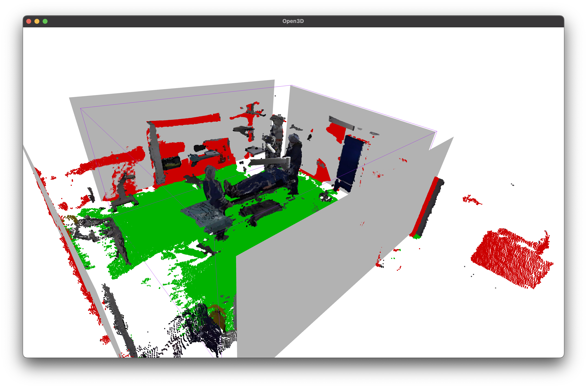

# atlas_point_labels
This project is used to annotate the walls, floors and persons within the point clouds of the ATLAS dataset.


# Preliminaries #

## File Structure ##

```
.
├── README.md
├── __init_paths__.py
├── configs
│   ├── <other config files>
│   ├── default.yaml
│   └── demo.yaml
├── data
│   ├── label_data
│   │   ├── <label data of other trials>
│   │   ├── demo
│   │   └── trial_08_recording_04
│   ├── smpl_files
│   │   ├── <smpl files of other trials>
│   │   ├── demo
│   │   └── trial_08_recording_04
│   ├── smpl_models
│   │   ├── J_regressor_coco.npy
│   │   └── smpl
│   └── trials
│       ├── <point clouds of other trials>
│       ├── demo
│       └── trial_08_recording_04
├── lib
│   ├── extraction
│   ├── smplmodel
│   └── utils
├── requirements.txt
├── run.py
├── scripts
    └── download_all.py

```

## Purpose ## 
| Directory | Functionality |
|---|---|
| `data/label_data` | Home of the pointclouds, label-files and the calibration file |
| `data/smpl_files` | Here are the files that describe the SMPL-Meshes in each frame generated by [EasyMocap](https://github.com/zju3dv/EasyMocap) |
| `data/smpl_models` | Here are the files necessary for loading the SMPL-Mesh parameter into a SMPL-Mesh model. (Download them via the `scripts/download_all.py` script |
| `data/trials` | Here are the point clouds of the trials, which will be used when generating new label data |
| `scripts/download_all.py` | Run this script to download sample data and the necessary SMPL files |


# Calibration #

For calibration an Open3D window will pop up and you can rotate, move the walls and floors with your keyboard.

> ⚠️ Open3D has sometimes the bug that it doesn't show the colors of the floor/wall that will be annotated. If the walls/floor don't have any color when rotating/moving, please rerun the script.


## Symbols ##

| Symbol | Meaning |
|---|---|
| Red points | Points that will be detected as **wall** |
| Green points | Points that will be detected as **floor** |
| Gray walls | The imaginary walls of the room |
| Purple box | The rough edges of a room that is aligned with the coordinate system |





## Key Mapping ##
| Key | Function |
|:---:|---|
| ← | Rotates the room to the left |
| → | Rotates the room to the right |
| ↑ | Increases the coverage of the wall detection |
| ↓ | Decreases the coverage of the wall detection |
| W | Moves north wall towards north |
| S | Moves north wall towards south |
| E | Moves south wall towards north |
| D | Moves south wall towards south |
| R | Moves east wall towards west |
| T | Moves east wall towards east |
| F | Moves west wall towards west |
| G | Moves west wall towards east |
| Return | Finishes calibration, starts labeling |
| B | Cancel program |


# Workflow #

1. Make sure to have the necessary point clouds in `data/trials/`
2. Generate a calibration file:
    - `python run.py --cfg configs/default.yaml -c`
    - Use the keys from the given key mapping. Press `Enter` to save the calibration file
3. Label the files given by your config:
    - `python run.py --cfg configs/default.yaml -a`
    - > ⚠️ This might take long. ~30s for each frame
4. (Optional) You can visualize the annotated frame with:
    - `python run.py --cfg configs/default.yaml -v`
    - This might also take a while depending how many frames you want to visualize